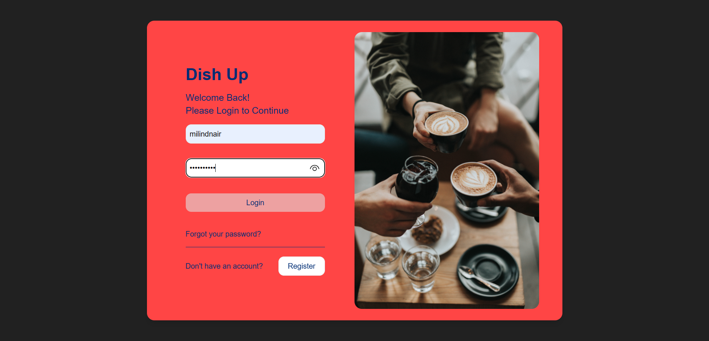

# DishDash: Where Food Lovers Connect and Explore

Welcome to DishDash, the ultimate social-media platform for foodies! Join a vibrant community of food bloggers, enthusiasts, and culinary adventurers who share their love for food and discover exciting gastronomic experiences.

## images

## Features

📸 **Share your mouthwatering moments**: Capture and post photos, videos, and thoughts about your culinary adventures, from homemade masterpieces to exquisite dishes at top restaurants.

🌍 **Explore local food scenes**: Stay updated on the latest restaurant events, food festivals, and trends in your area. Discover hidden gems and share your recommendations with fellow foodies.

🤝 **Connect with food enthusiasts**: Follow and engage with other users, exchanging ideas, and forming meaningful connections with like-minded individuals who appreciate the art of good food.

🔍 **Advanced search**: Find specific users, top-rated restaurants, or trending dishes with our powerful search feature. Dive into a world of flavors and experiences tailored to your preferences.

🎉 **Engaging and interactive**: Like, comment, and engage with posts that inspire you. Spark conversations, share tips, and be a part of a thriving food community.

## Installation

1. Clone the repository: `git clone https://github.com/your-username/dishdash.git`
2. Navigate to the project directory: `cd dishdash`
3. Install dependencies: `npm install`
4. Start the application: `npm start`

## Technologies Used

- HTML5
- CSS3
- JavaScript
- Node.js
- Express.js
- MongoDB

## Contributing

Contributions are welcome! If you have any suggestions or find any bugs, please open an issue or submit a pull request.

## License

This project is licensed under the [MIT License](LICENSE).

## Contact

For any inquiries or feedback, please contact us at [email protected]

Join us today and let the food journey begin!

